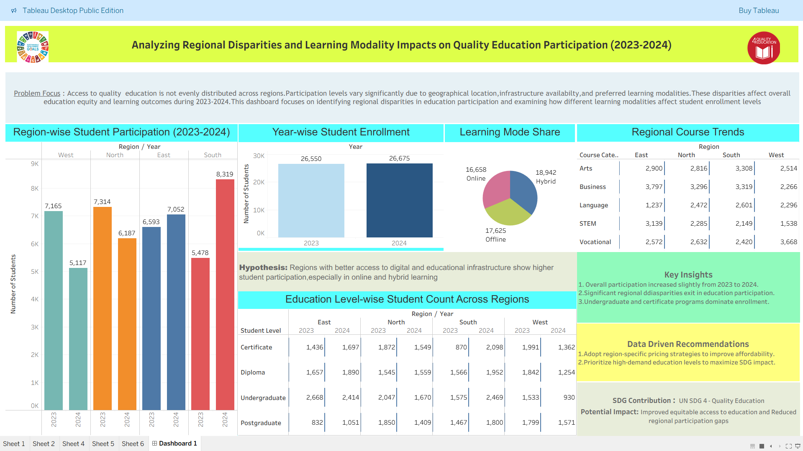

# Education_Quality_Tableau_Dashboard
Tableau-based analysis of regional disparities and learning modality impacts on quality education participation across different education levels during 2023–2024, aligned with SDG 4.
# 📊 Analyzing Regional Disparities and Learning Modality Impacts on Quality Education Participation (2023–2024)

## 📌 Project Overview

This Tableau project analyzes **quality education participation across different regions and learning modalities during 2023–2024**.

The project focuses on identifying regional disparities in student participation and understanding how different learning modes — **Online, Offline, and Hybrid** — influence participation across different education levels.

The analysis is aligned with **United Nations Sustainable Development Goal 4 (SDG 4): Quality Education**, which aims to ensure inclusive and equitable quality education and promote lifelong learning opportunities for all.

---

## 🎯 Project Objectives

The main objectives of this project are:

* Analyze student participation across different regions.
* Compare **Online, Offline, and Hybrid** learning modalities.
* Examine participation across different education levels.
* Identify regional disparities in educational participation.
* Compare participation between **2023 and 2024**.
* Identify patterns and trends that can support better educational planning.
* Present the findings through an interactive Tableau dashboard.

---

## ❓ Problem Statement

Educational participation can vary significantly between regions and learning modalities. Differences in access, infrastructure, technology, and educational resources may influence how students participate in different modes of learning.

This project attempts to answer:

> **How do regional differences and learning modalities affect participation in quality education across different education levels during 2023–2024?**

---

## 💡 Hypothesis

**H₀ (Null Hypothesis):**
Regional differences and learning modalities have no significant effect on student participation.

**H₁ (Alternative Hypothesis):**
Regional differences and learning modalities influence student participation.

---

## 📚 Dataset

The dataset contains educational participation information for the years **2023 and 2024**.

### Dataset Fields

| Field              | Description                                          |
| ------------------ | ---------------------------------------------------- |
| Year               | Academic/observation year                            |
| Region             | Geographical region                                  |
| Number of Students | Number of participating students                     |
| Learning Mode      | Online, Offline, or Hybrid                           |
| Education Level    | Certificate, Diploma, Undergraduate, or Postgraduate |

The dataset covers **4 regions**, multiple learning modalities, and different education levels across two years.

---

## 📊 Dashboard

The Tableau dashboard provides an interactive visualization of the dataset.

### Key Dashboard Components

* 📈 **Year-wise Participation Analysis**
* 🌍 **Regional Participation Comparison**
* 💻 **Learning Modality Analysis**
* 🎓 **Education Level Analysis**
* 📊 **Student Participation Trends**
* 🔎 **Interactive Filters**

Users can explore the data by selecting different years, regions, learning modes, and education levels.

---

## 🔍 Key Analysis Areas

### 1. Regional Disparities

The dashboard compares student participation among different regions to identify differences in educational participation.

This helps highlight regions with relatively higher or lower participation and provides a basis for understanding geographical differences.

### 2. Learning Modality

The project compares three learning modes:

* **Online**
* **Offline**
* **Hybrid**

This analysis helps understand how student participation is distributed across different learning approaches.

### 3. Education Level

Participation is analyzed across:

* Certificate
* Diploma
* Undergraduate
* Postgraduate

This helps identify which educational levels contribute more significantly to overall participation.

### 4. Year-wise Comparison

The dashboard compares **2023 and 2024** to identify changes in participation and understand whether participation increased or decreased over time.

---

## 📈 Tableau Visualizations

The project uses different Tableau visualizations to communicate the findings effectively, including:

* Bar Charts
* Line Charts
* Comparison Charts
* Regional Analysis
* Learning Mode Analysis
* Education Level Analysis
* Interactive Filters

These visualizations make the dataset easier to understand and allow users to explore different dimensions of educational participation.

---

## 🎛️ Interactive Features

The Tableau dashboard includes filters that allow users to dynamically explore the data.

Users can filter the dashboard based on:

**Year → Region → Learning Mode → Education Level**

This makes it possible to analyze specific combinations and compare different categories.

---

## 🌍 SDG 4 Connection

This project is related to:

### **UN Sustainable Development Goal 4 — Quality Education**

SDG 4 focuses on ensuring inclusive and equitable quality education and promoting lifelong learning opportunities.

The project contributes to this theme by analyzing educational participation and identifying differences between regions, learning modalities, and education levels.

Data-driven analysis can help educational institutions and policymakers better understand participation patterns and areas that may require additional attention.

---

## 💭 Insights

The dashboard can be used to identify:

* Differences in participation between regions.
* Changes in participation between 2023 and 2024.
* Distribution of students across Online, Offline, and Hybrid learning.
* Participation patterns across education levels.
* Regions or categories requiring further investigation.
* Changes in learning preferences over time.

> **Note:** Specific numerical findings should be interpreted directly from the Tableau dashboard and underlying dataset.

---

## 💡 Recommendations

Based on the analysis, educational stakeholders can consider:

1. Improving educational infrastructure in regions with lower participation.
2. Supporting access to digital learning facilities.
3. Strengthening offline educational resources where required.
4. Promoting flexible Hybrid learning opportunities.
5. Monitoring participation across different education levels.
6. Using data-driven approaches for educational planning.
7. Conducting further research to understand the causes behind regional disparities.

---

## 🛠️ Tools & Technologies

| Tool                            | Purpose                                      |
| ------------------------------- | -------------------------------------------- |
| **Tableau**                     | Data visualization and dashboard development |
| **Google Sheets / Spreadsheet** | Dataset preparation                          |
| **GitHub**                      | Project documentation and version control    |
| **Markdown**                    | README documentation                         |

---

## 📁 Project Files

The repository may contain the following files:

```text
📦 Tableau-Education-Participation
│
├── 📊 Education_Dashboard.twbx
├── 📄 Education_Dataset.xlsx
├── 🖼️ Dashboard_Screenshot.png
├── 📑 Project_Report.pdf
└── 📖 README.md
```

### File Description

**Education_Dashboard.twbx**
Tableau packaged workbook containing the dashboard and associated data.

**Education_Dataset.xlsx**
Dataset used for analysis and visualization.

**Dashboard_Screenshot.png**
Image preview of the completed Tableau dashboard.

**Project_Report.pdf**
Detailed project documentation and analysis.

**README.md**
Project overview, methodology, objectives, analysis, and documentation.

---

## 🔄 Project Workflow

```text
Data Collection
       ↓
Data Preparation
       ↓
Data Cleaning
       ↓
Exploratory Data Analysis
       ↓
Tableau Visualization
       ↓
Dashboard Development
       ↓
Analysis & Insights
       ↓
Recommendations
       ↓
GitHub Documentation
```

---

## 🎓 Academic Information

**Project Title:**
Analyzing Regional Disparities and Learning Modality Impacts on Quality Education Participation (2023–2024)

**Student:** Snehal Pal

**Department:** Department of Computer Applications

**Program:** Bachelor of Computer Applications (BCA)

**Academic Session:** 2025–2026

**Project Domain:** Data Analytics & Data Visualization

**Tool Used:** Tableau

**SDG:** SDG 4 — Quality Education

---

## 📸 Dashboard Preview

Add your Tableau dashboard screenshot here.

```markdown

```

---

## 🚀 How to Use This Project

1. Download or clone this repository.
2. Open the `.twbx` file using Tableau Desktop or Tableau Reader, where supported.
3. Explore the dashboard.
4. Use the available filters to analyze different years, regions, learning modes, and education levels.
5. Refer to the project report for detailed analysis.

---

## 📌 Conclusion

This Tableau project provides a visual analysis of educational participation across regions, learning modalities, education levels, and years.

By presenting the data through an interactive dashboard, the project makes it easier to identify participation patterns and regional differences. The analysis also demonstrates how **data visualization can support evidence-based understanding of quality education and contribute to the broader objectives of SDG 4**.

---

## 👨‍💻 Author

**Snehal Pal**
Bachelor of Computer Applications (BCA)
Department of Computer Applications
Academic Session: 2025–2026

---

## ⭐ Project

If you find this project useful, consider giving the repository a ⭐ on GitHub.
